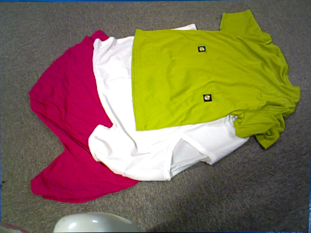
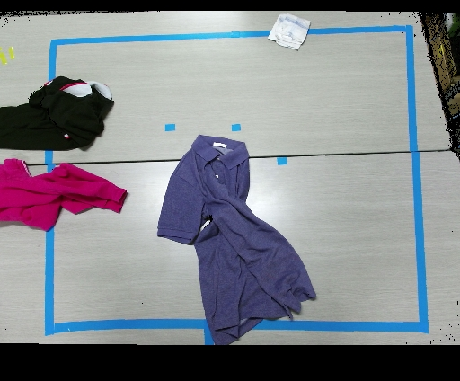

# Problem Statement

I have this kinds of images:






Dataset comprises of 350[2-3 Tshirts] + 2000[5-6Tshirts]
D1 + D2. D1 is relatively cleaner and has distinct seperable boundaries. In contrast, D2 is very noisy in different color spaces. There are also many different unrequired objects in D2, which may make labelling and training harder. 

The key point is I have texture-less, mostly monochromatic T-shirts, which is of great importance in using color based segmentation & thresholding.

For each image, I would like to generate N masks, one each for every T shirt.

There are a variey of different methods which vary in degree of automation and generalization.

One approch is to choose a HSV thresholds of max and min therefore 6 values for each mask(each T shirt color) to be generated.

Another apporach is to apply Otsu's method and Image quantization, which is not as mannaul as the previous one.

These algorithms are also tested in different color spaces.

# Current Directory structure [excluding files]

```
.
├── 2TC         # 2 T-shirt images
├── 2TD         # 2 T-shirt images 
├── 2TP         # 2 T-shirt
├── 3T          # 3 T-shirt images
├── capture     # 6 T-shirt images [Noisy]
└── samples     # Samples from the above folders
```

# Splitting image into masks using L * A * B color space
It works best in case of clean and distinct color distributions.

On Matlab  command prompt:
```
% Image Path is the path to your image, Num Regions is the number of regions you need to split in
> lab_segment( <image_path> , <num_regions>)

```
For my 1st sample image, I would like to split into 3 regions for Green Tshirt, White Tshirt and background

For batch processing, I first collected all file paths of 2T folder into files named image2Paths.txt etc.
``` 
ls 2TC/ > image2Paths.txt
```
and likewise for other folders and then made a script to process that text file.
```
> preprocess( <filepath>, <num_regions>)
```
Which will apply lab_segment to all the images named inside that file


# Thresholding in H * S * V color space
It works best in case of clean and distinct color distributions.

Script segment.m will work on all the image paths given inside filename and will call different scripts for different colors.

```
% Image Path is the path to your image, Num Regions is the number of regions you need to split in
> segment( <file_path> )

```
Similarly use segmentCapture.m for D2 [The kinect dataset]

# Hurdles
1. How to evaluate accuracy/ generalizability of this method ?
2. This data will actually go into a segmentation neural network to train, then why am I using Neural net again ?
[Because I'm hoping that with batch normalization, the neural network will generalize enough to overcome the color specificness and heruristics ? ]
3. The degree of automation goes down when you want more precise masks.

# Results
Results on some images from D1 and D2 can be seen in folder sample_outputs/
